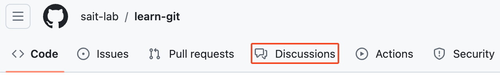
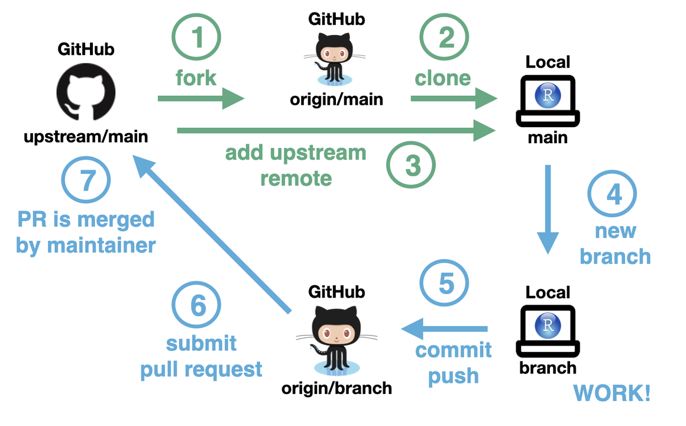

## Learn Git

  

This repository serves as a demonstration of Git, based on the book [Pro Git 2nd Edition](https://github.com/progit/progit2/) available at https://git-scm.com/book/en/v2. It is recommended to read Chapters 1, 2, 3, and 6 to grasp the fundamentals of Git.

You are encouraged to use the discussions feature of this repository to ask questions.

 

## Documents

Below are the links to the documents available in this repository. Each link provides a detailed guide on the respective topic.

### 1. [Git Basics](git-basics.md)
This document covers the concept of version control, what is Git and basic commands of Git. You should be able to configure and initialize a repository, begin and stop tracking files, and stage and commit changes. It also shows you how to set up Git to ignore certain files and file patterns, how to undo mistakes quickly and easily, how to browse the history of your project and view changes between commits, and how to push and pull from remote repositories.

### 2. [Git Branching](git-branching.md)
This document covers the way Git does branching. Git encourages workflows that branch and merge often, even multiple times in a day. Understanding and mastering this feature gives you a powerful and unique tool and can entirely change the way that you develop.

### 3. [Forking Workflow](forking-workflow.md)
This document covers common workflows to contribute to projects and to accept contributions to yours, GitHub’s programmatic interface and lots of little tips to make your life easier in general.

### 4. [Advanced Topics](advanced-git.md) 🚧

This document covers advanced Git topics such as rebasing, reflog, stashing, cleaning, rewriting history, and advanced merging techniques that provide powerful tools for managing complex repository histories and streamlining development workflows.

## Git Cheat Sheet

[git-cheat-sheet.pdf (gitlab.com)](https://about.gitlab.com/images/press/git-cheat-sheet.pdf)

[git_cheat_sheet.pdf (datacamp.com)](https://images.datacamp.com/image/upload/v1656573882/Marketing/Blog/git_cheat_sheet.pdf)

https://ohshitgit.com/ or https://dangitgit.com/en

[17 Ways to Undo Mistakes with Git](https://www.git-tower.com/blog/surviving-with-git-videos/)

## Git Workflows

 
Credit: [Chapter 15 Git Command Line Interface (CLI) | The Shiny AWS Book (business-science.github.io)](https://business-science.github.io/shiny-production-with-aws-book/git-command-line-interface-cli.html)

 
Credit: [A Git Workflow for Data Teams (getdbt.com)](https://www.getdbt.com/analytics-engineering/transformation/git-workflow)

 
Credit: [Git and GitHub demystified: A Guide to Open Source Contribution](https://www.linkedin.com/pulse/git-github-demystified-guide-open-source-contribution-nishan-baral-i4ndc/)

## Contributing

Feel free to fork this repository and submit pull requests with improvements to the documents or suggestions for additional guides. Your contributions are highly appreciated!

## License

This document is licensed under the Creative Commons Attribution 4.0 International License. To view a copy of this license, visit http://creativecommons.org/licenses/by/4.0/.

### You are free to:

- **Share** — copy and redistribute the material in any medium or format for any purpose, even commercially.

- **Adapt** — remix, transform, and build upon the material for any purpose, even commercially.

The licensor cannot revoke these freedoms as long as you follow the license terms.

### Under the following terms:

- **Attribution** — You must give [appropriate credit](https://creativecommons.org/licenses/by/4.0/deed.en#ref-appropriate-credit), provide a link to the license, and [indicate if changes were made](https://creativecommons.org/licenses/by/4.0/deed.en#ref-indicate-changes). You may do so in any reasonable manner, but not in any way that suggests the licensor endorses you or your use.
- **No additional restrictions** — You may not apply legal terms or [technological measures](https://creativecommons.org/licenses/by/4.0/deed.en#ref-technological-measures)that legally restrict others from doing anything the license permits.

### Notices:

You do not have to comply with the license for elements of the material in the public domain or where your use is permitted by an applicable [exception or limitation](https://creativecommons.org/licenses/by/4.0/deed.en#ref-exception-or-limitation).

No warranties are given. The license may not give you all of the permissions necessary for your intended use. For example, other rights such as [publicity, privacy, or moral rights](https://creativecommons.org/licenses/by/4.0/deed.en#ref-publicity-privacy-or-moral-rights) may limit how you use the material.

