## Forking Workflow

https://www.atlassian.com/git/tutorials/comparing-workflows/forking-workflow

> The Forking Workflow is fundamentally different than other popular Git workflows. Instead of using a single server-side repository to act as the “central” codebase, it gives every developer their own server-side repository. This means that each contributor has not one, but two Git repositories: a private local one and a public server-side one. The Forking Workflow is most often seen in public open source projects.

> The main advantage of the Forking Workflow is that contributions can be integrated without the need for everybody to push to a single central repository. Developers push to their own server-side repositories, and only the project maintainer can push to the official repository. This allows the maintainer to accept commits from any developer without giving them write access to the official codebase.

> The Forking Workflow begins with an official public repository stored on a server. But when a new developer wants to start working on the project, they do not directly clone the official repository.
>
> Instead, they fork the official repository to create a copy of it on the server. This new copy serves as their personal public repository—no other developers are allowed to push to it, but they can pull changes from it (we’ll see why this is important in a moment). After they have created their server-side copy, the developer performs a git clone to get a copy of it onto their local machine. This serves as their private development environment, just like in the other workflows.

https://git-scm.com/book/en/v2/GitHub-Contributing-to-a-Project

>This way, projects don’t have to worry about adding users as collaborators to give them push access. People can fork a project, push to it, and contribute their changes back to the original repository by creating what’s called a Pull Request, which we’ll cover next. This opens up a discussion thread with code review, and the owner and the contributor can then communicate about the change until the owner is happy with it, at which point the owner can merge it in.

1. A developer 'forks' an 'official' server-side repository. This creates their own server-side copy.

   To fork a project, visit the project page and click the “Fork” button at the top-right of the page. This creates a fork of the repo to `github.com/YOUR_GITHUB_USERNAME/project`.
   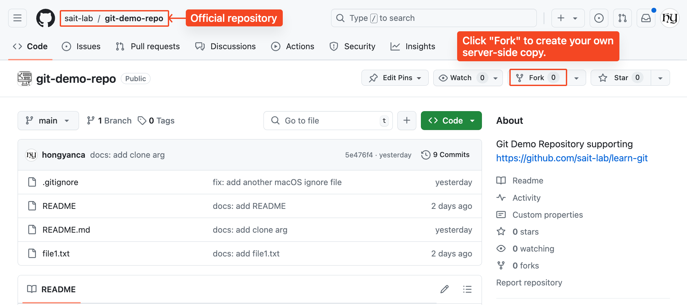 

    

   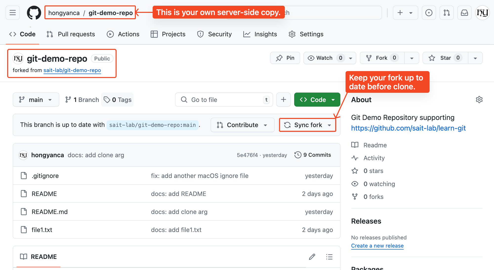 

2. On your local system you execute `git clone` on `github.com/YOUR_GITHUB_USERNAME/project` to clone the new server-side copy to your local system.
   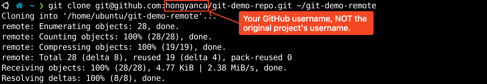 

3. Create a local topic branch from `main`.
   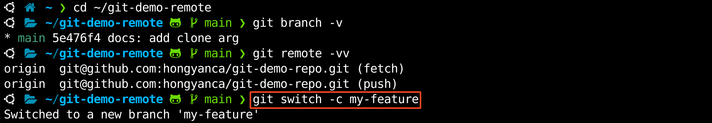 

4. Make some commits to improve the project.
   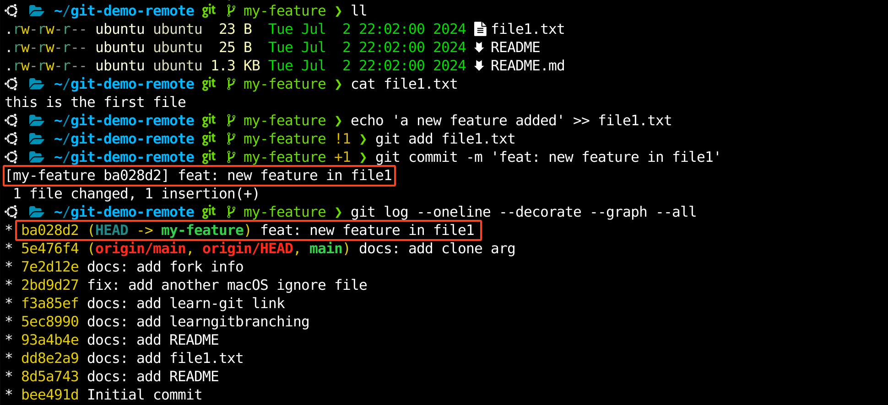 

5. Push this branch to **your** remote forked repo.
   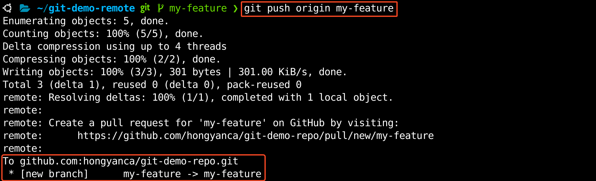 

6. Open a Pull Request on GitHub for the new topic branch against the original repo.
   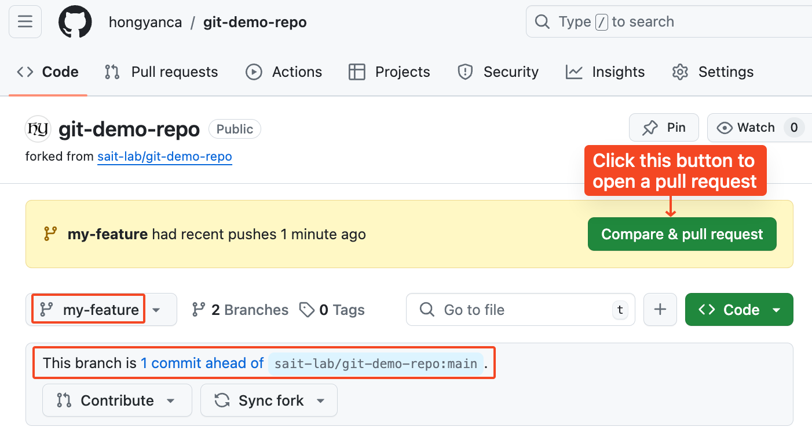 

   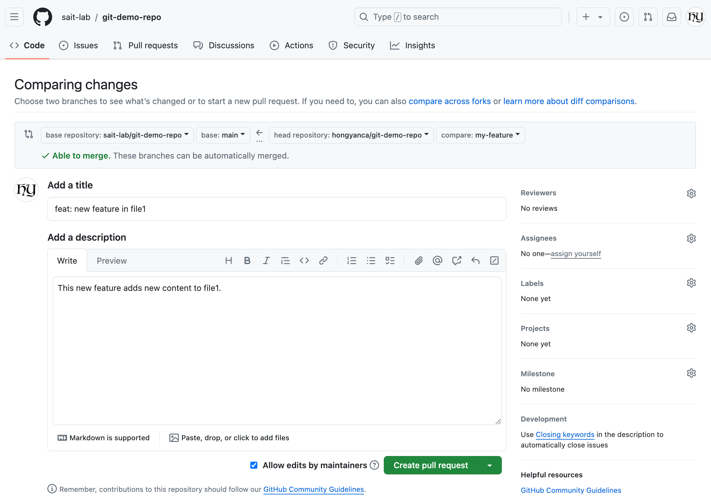 

   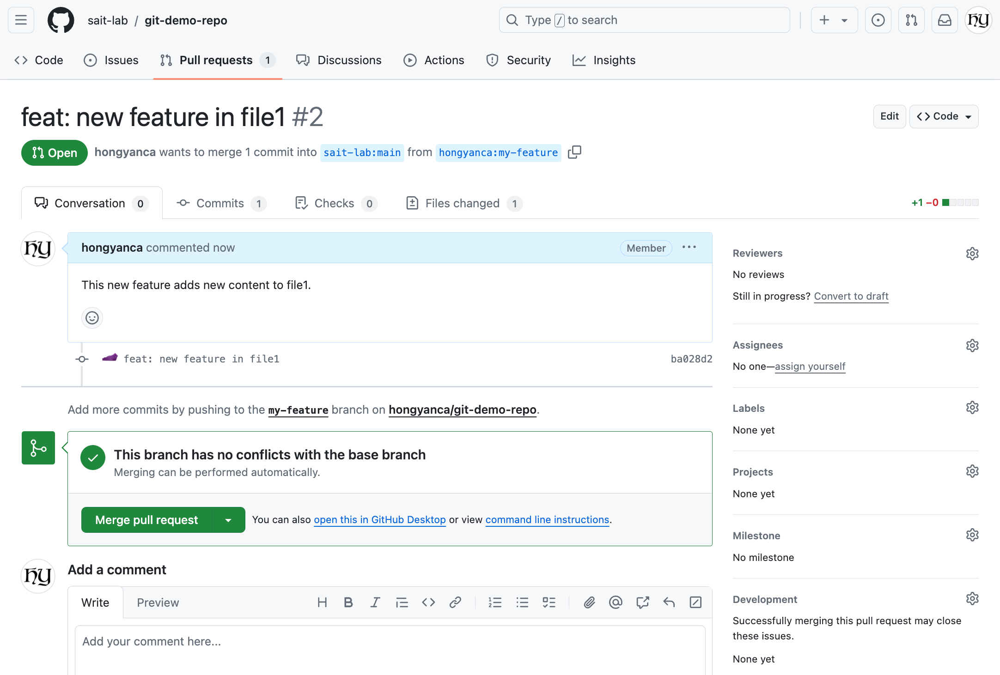 

7. Discuss, and optionally continue committing.

8. The **project owner** merges or closes the Pull Request.
   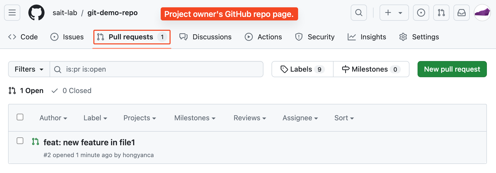 

   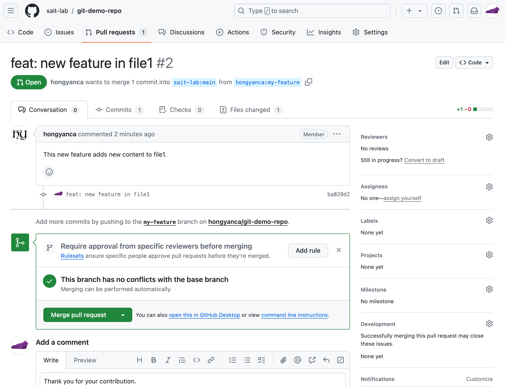 
    

   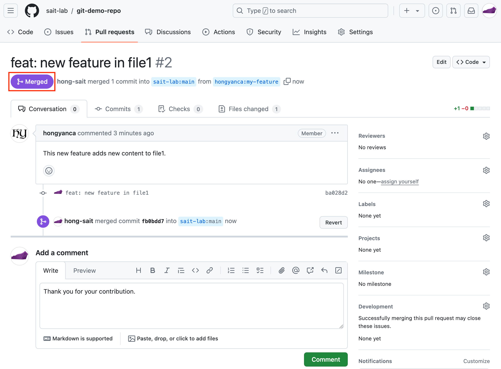 

9. You, as a contributor, sync the updated `main` branch back to your fork.
   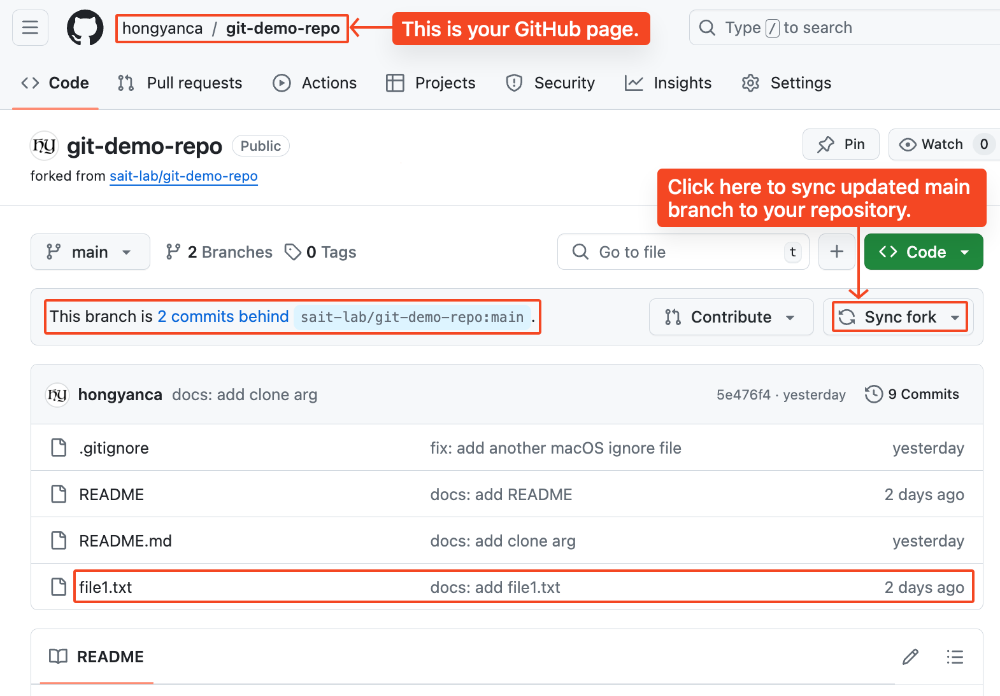 

   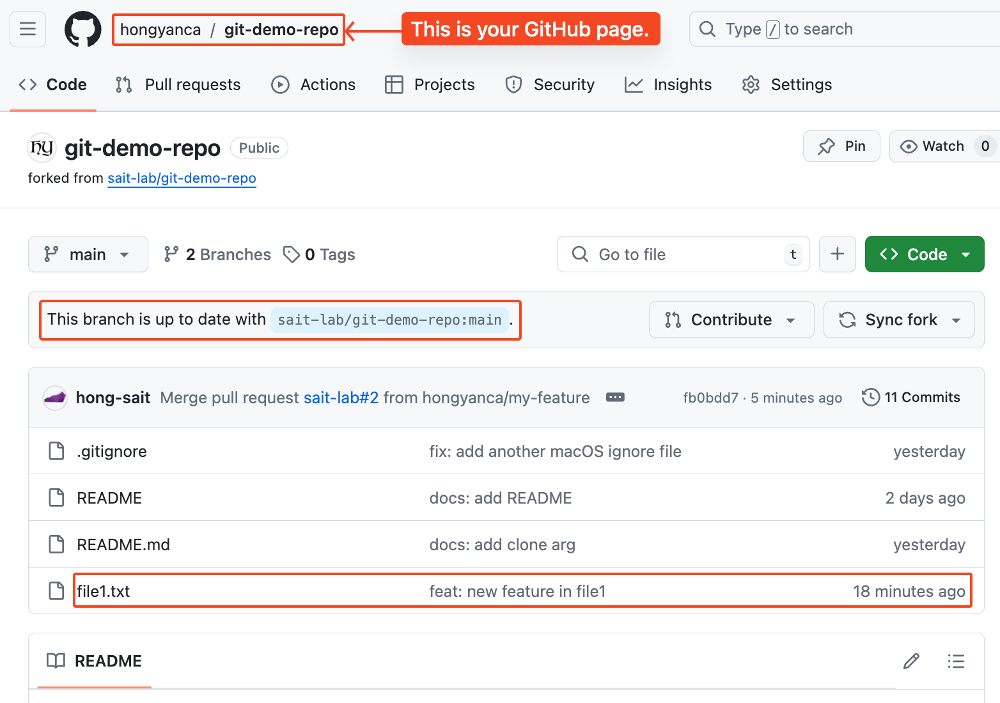 

> The Forking Workflow helps a maintainer of a project open up the repository to contributions from any developer without having to manually manage authorization settings for each individual contributor. This gives the maintainer more of a "pull" style workflow. Most commonly used in open-source projects, the Forking Workflow can also be applied to private business workflows to give more authoritative control over what is merged into a release. This can be useful in teams that have Deploy Managers or strict release cycles.

 

 

 

